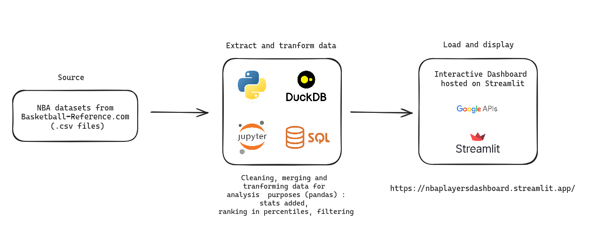

# NBA_Players_Dashboard
Find the statistics of your favorite player and compare him with another!

The aim of this project is to access the statistics of the player of your choice, obtain the characteristics of his player profile and compare him with another player.

# Interface
https://nba-players-dashboard.streamlit.app/

# Project

# Stack

## Python : Data ETL, analysis, and development of the web application on Streamlit.
## SQL : Managing and querying players databases, organizing and retrieving player statistics efficiently.
## DuckDB : In-memory analytical database management system, facilitating data manipulation and creation of dataframes.
## Jupyter Notebook : Interactive computing environment for code execution, visualization, and documentation in a single document.
## Streamlit : Python library for building interactive web applications for data visualization and analysis.
## Airflow : Platform for orchestrating workflows and scheduling tasks, useful for automating data collection and processing.
## Google API : Cloud Storage

# Context
As a basketball player, NBA fan and aspiring to work in data architecture and analysis, I created this dashboard application to provide detailed statistics on a player and his strengths, as well as the ability to compare players against each other.
These analyses are based on statistics gathered from BasketballReference.com.
To do this, I built Python functions and modules to collect, clean and transform the raw data.  
I used several Pandas libraries, such as pandas and numpy, for data extraction, transformation and vizualisation. .
My approach also includes categorizing players according to their offensive and defensive profiles to give the user additional quick insight.  
To do this, I assigned profiles to each player by analyzing their playing statistics.  
My aim with this project is to provide basketball fans and professionals alike with detailed, easy-to-interpret data on the performance of NBA players, while demonstrating my skills in data engineering and analysis.

# Sources
https://www.basketball-reference.com/

# Next steps
In no order :
- Add a feature enabling comparison between players across different seasons (e.g. LeBron James 2018 vs Nikola Jokic 2022)
- Scrap the data through NBA's API
- Display leaders in major standard stat categories in frontpage
- Allow direct filtering (by G, Mins, FT%, ...) on any players database
- Build more accurate players profiles
- Add vizualisation tools to compare players (spider chart, line chart)
- ...
