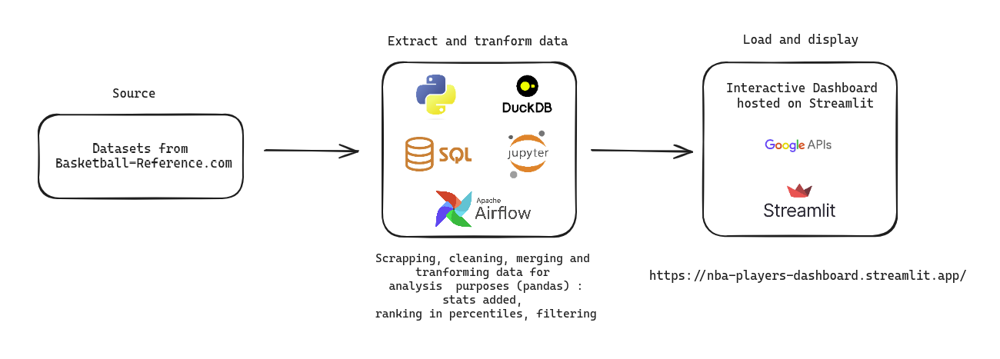

# NBA_Players_Dashboard
Find the statistics of your favorite player and compare him with another!

The aim of this project is to access the statistics of the player of your choice, obtain the characteristics of his player profile and compare him with another player.

# Interface
https://nbaplayersdashboard.streamlit.app/

# Project

# Context
As a basketball player, NBA fan and aspiring to work in data architecture and analysis, I created this dashboard application to provide detailed statistics on a player and his strengths, as well as the ability to compare players against each other.
These analyses are based on statistics gathered from the BasketballReference.com website in csv format.
To do this, I developed and used Python functions and modules to collect, clean and transform the raw data.  
I used several Pandas libraries, DuckDB for data manipulation and the creation of dataframes, as well as visualization libraries such as Altair and Plotly Express to create interactive graphics.  
My approach also includes categorizing players according to their offensive and defensive profiles to give the user additional quick insight.  
To do this, I assigned profiles to each player by analyzing their playing statistics.  
My aim with this project is to provide basketball fans and professionals alike with detailed, easy-to-interpret data on the performance of NBA players, while demonstrating my skills in data manipulation and analysis.

# Sources
https://www.basketball-reference.com/

# Next steps
In no order :
- Scrap the data through NBA's API and store the input data on the cloud
- Get 10 years of data
- Display leads in major standard stat categories in frontpage
- Allow filtering (by G, Mins, FT%, ...) on any players database
- Build more accurate players profiles
